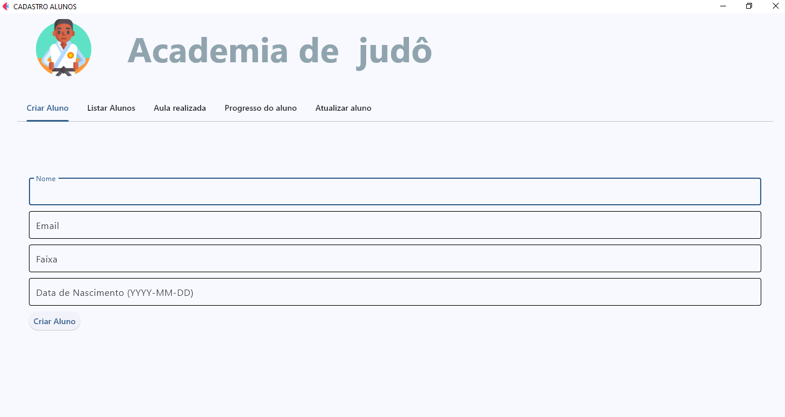

# 📱 + 🌐 APP Mobile & REST API 
**Desenvolvido com Python, Django e Flet**  
🚀 _Sistema integrado com frontend mobile (Flet) e backend API (Django REST Framework)_

<p align="center">
  
  
  
  
</p>

---

## 🚀 Funcionalidades Principais
- **📱 App Mobile (Flet)**  
  - Interface multiplataforma (iOS/Android/Web)  
  - Autenticação de usuários  
  - Integração com API REST  
  - Interface personalizada com widgets Flet  

- **🌐 Backend (Django REST)**  
  - API RESTful com DRF (Django REST Framework)  
  - Banco de dados SQLite (ou PostgreSQL em produção)  
  - Rotas para CRUD de usuários/dados  
  - Documentação automática (Swagger/Redoc)  

---

## 🛠️ Tecnologias  
### **Backend**  
🐍 `Python 3.11` | 🎸 `Django 5.0` | 🔧 `Django REST Framework` | 🗃️ `SQLite`  

### **Frontend Mobile**  
🎨 `Flet` | 📡 `Requests` | 🔄 `Async/Await`  

### **Bibliotecas**  
```python
# Backend
django-cors-headers  # CORS
drf-yasg             # Documentação da API
python-decouple      # Variáveis de ambiente

# Mobile
flet                 # UI/UX
requests             # Chamadas HTTP
httpx                # APIs Async


# 📱 APP Mobile + REST API para Gestão de Alunos

<div align="center">
  
  
</div>

## 🖼️ Galeria de Imagens

### Telas Principais
| Tela de Login | Dashboard Alunos |
|---------------|------------------|
|  |  |

### Fluxo do Sistema
```markdown


<p>
  

</p>

